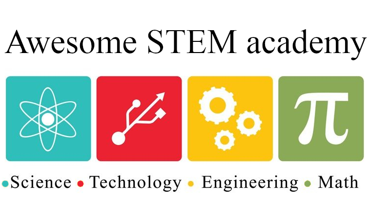

  <a href="httpg://github.com/sindresorhus/awesome">  

  <a href="https://github.com/tapyu/awesome-stem-academy">
    
  

<table align="center">
  <tr>
    <td width="275">"<i>The most vitally characteristic fact about Mathematics is, in my opinion, its quite peculiar relationship to the natural sciences, or, more generally, to any science which interprets experience on a higher than purely descriptive level.</i>"</td>
    <td width="250" align="center"> 
<a href="https://en.wikipedia.org/wiki/John_von_Neumann">John von Neumann.</td>
  </tr>
</table>
<h4 align="center">An awesome list of academic resources for STEM (Science, Technology, Engineering, Mathematics) organized by subjects.</h4>

 

<!-- 

  Created by
  <a href="https://github.com/tapyu">tapyu and
  <a>contributors.

 -->

<!-- START doctoc generated TOC please keep comment here to allow auto update -->
<!-- DON'T EDIT THIS SECTION, INSTEAD RE-RUN doctoc TO UPDATE -->
## Contents

- [Algorithm Theory](#algorithm-theory)
- [Artificial Intelligence & Data Science](#artificial-intelligence--data-science)
  - [Machine Learning & Neural Networks](#machine-learning--neural-networks)
- [Linear Algebra](#linear-algebra)
- [Communication Systems](#communication-systems)
  - [GNSS](#gnss)
- [Optimization Theory](#optimization-theory)
- [Numerical Methods](#numerical-methods)
- [Signal Processing](#signal-processing)
  - [Signals & Systems](#signals--systems)
  - [Digital Signal Processing](#digital-signal-processing)
  - [Adaptive Filtering & Statistical Signal Processing](#adaptive-filtering--statistical-signal-processing)

<!-- END doctoc generated TOC please keep comment here to allow auto update -->

 

## Algorithm Theory

- [`course`](https://www.youtube.com/playlist?list=PLOtl7M3yp-DXbHTFe_w9zFPXeau28CDao) [`book`](https://mimoza.marmara.edu.tr/~msakalli/cse706_12/SkienaTheAlgorithmDesignManual.pdf) [`code`](https://www.algorist.com/) **CSE373 - Analysis of Algorithms** - Taught by Prof. Steven Skiena. He covers topic such as data structure, searching and sorting algorithms, shortest-path algorithms, dynamic programming, and NP-Completeness.
- [`course`](https://see.stanford.edu/Course/CS106B) **CS106B - Programming Abstractions** - Stanford Engineering Everywhere: Object-oriented programming, fundamental data structures (such as stacks, queues, sets) and data-directed design. Recursion and recursive data structures (linked lists, trees, graphs). Introduction to time and space complexity analysis. Uses the programming language C++ covering its basic facilities.
- [`book`](https://github.com/calvint/AlgorithmsOneProblems/blob/master/Algorithms/Thomas%20H.%20Cormen,%20Charles%20E.%20Leiserson,%20Ronald%20L.%20Rivest,%20Clifford%20Stein%20Introduction%20to%20Algorithms,%20Third%20Edition%20%202009.pdf) [`code`] - **Introduction to Algorithms. Thomas H. Cormen, Charles E. Leiserson, Ronald L** - C Implementation of all the algorithms and data structures discussed in the textbook Introduction to Algorithms by Thomas H. Cormen, et al.
- [`reading`](https://www.teach.cs.toronto.edu/~csc110y/fall/notes/) **Foundations of Computer Science** - Course Notes for CSC110 and CSC111: Propositional Logic; Big-O, Omega, Theta; Data Types, Abstract and Concrete; Linked Lists; Induction and Recursion; Trees; Graphs; Sorting.
- [`video`](https://www.youtube.com/watch?v=A60q6dcoCjw) **The hidden beauty of the A\* algorithm.**
- [`video`](https://www.youtube.com/watch?v=EFg3u_E6eHU) **How Dijkstra's Algorithm Works.**
- [`video`](https://www.youtube.com/watch?v=K1a2Bk8NrYQ) **Understanding B-Trees: The Data Structure Behind Modern Databases**
- [`code`](https://github.com/krahets/hello-algo/blob/main/README-en.md) **hello-algo** - Data Structures and Algorithms Crash Course with Animated Illustrations and Off-the-Shelf Code.

## Artificial Intelligence & Data Science
- [`course`](https://www.coursera.org/specializations/data-science-python) **Applied Data Science with Python Specialization** - Gain new insights into your data. Learn to apply data science methods and techniques, and acquire analysis skills. University of Michigan. Coursera.
- [`course`](https://www.coursera.org/specializations/advanced-data-science-ibm) **Advanced Data Science with IBM Specialization** - Expert in Data Science, Machine Learning and AI. Become an IBM-approved Expert in Data Science, Machine Learning and Artificial Intelligence. Coursera.
- [`reading`](https://github.com/microsoft/AI-For-Beginners/tree/main) **AI-For-Beginners** - A 12 Weeks, 24 Lessons, AI for All.

### Machine Learning & Neural Networks

- [`course`](https://www.youtube.com/playlist?list=PLkDaE6sCZn6Gl29AoE31iwdVwSG-KnDzF) **Convolutional Neural Networks** - A DeepLearningAI course on YouTube.
- [`course`](https://www.cs.cmu.edu/~10315-s23/#current_rec) **Introduction to Machine Learning** - 10-315, Spring 2023. Carnegie Mellon University (CMU).
- [`course`](https://www.youtube.com/playlist?list=PL7y-1rk2cCsAqRtWoZ95z-GMcecVG5mzA) [`reading`](https://www.cs.cmu.edu/~10606-f22/) [`code`](https://github.com/bwilder0/10606-f23/tree/main) **Mathematical Foundations for Machine Learning** - 10-606, Fall 2022. Carnegie Mellon University (CMU).
- [`book`](https://libgen.rs/book/index.php?md5=6C72973849A5A771F5D66BF9A2694FC6) [`code`](https://github.com/dynamicslab/databook_matlab) **Data-Driven Science and Engineering: Machine Learning, Dynamical Systems, and Control** - By Steven L. Brunton and J. Nathan Kutz. 1th edition.
- [`book`](https://mml-book.github.io/book/mml-book.pdf) [`reading`](https://mml-book.github.io/) [`code`](https://github.com/mml-book/mml-book.github.io) **Mathematics for Machine Learning Book** - by A. Aldo Faisal, Cheng Soon Ong, and Marc Peter Deisenroth. <!-- It uses numerator layout! -->
- [`book`](https://github.com/xinlin192/DeepLearning/blob/master/Neural%20Networks%20and%20Learning%20Machines%20(3rd%20Edition).pdf) [`code`](https://github.com/irustandi/Neural-Networks-and-Learning-Machines-Haykin) [`code`](https://www.mathworks.com/matlabcentral/fileexchange/123880-fundamentals-of-neural-networks) [`code`](https://github.com/ocimakamboj/NNLS?tab=readme-ov-file) **Neural Networks and Learning Machines** - By Simon Haykin. 3th edition.
- [`video`](https://www.youtube.com/watch?v=mWgRprKIoIs) **Creating Deep Learning Models Using Keras.** - Deep Learning, Simplilearn.
- [`video`](https://www.youtube.com/watch?v=w8yWXqWQYmU) **Building a neural network from scratch.**
- [`video`](https://www.youtube.com/watch?v=JB8T_zN7ZC0) **How convolutional neural networks work, in depth.**
- [`video`](https://www.youtube.com/watch?v=uapdILWYTzE) **MIT 6.S191 (2022): Convolutional Neural Networks.**
- [`video`](https://www.youtube.com/watch?v=vhz2pgfOpaw) **Bias Variance trade-off.**
- [`code`](https://github.com/wiseodd/generative-models) **generative-models** - Collection of generative models, e.g. GAN, VAE in Pytorch and Tensorflow.
- [`code`](https://github.com/rasbt/LLMs-from-scratch) **LLMs-from-scratch** - Implementing a ChatGPT-like LLM from scratch, step by step.

## Linear Algebra

- [`course`](https://github.com/mitmath/1806) [`code`](https://github.com/shahrokh-bahtooei/Linear-Algebra-Gilbert-Strang) **MIT 18.06, Linear Algebra** - By Professor Gilbert Strang.
- [`course`](https://www.youtube.com/watch?v=IP7nW_hKB7I&list=PLi01XoE8jYoi3SgnnGorR_XOW3IcK-TP6&ab_channel=Socratica) - **Abstract Algebra** - A YouTube course from Socratica.
- [`book`](https://drive.google.com/file/d/1zdIDyV8qDBWNmmlwhBw7EtLu_pyacdOh/view) [`solution`](https://github.com/8128/SharedResources/blob/master/Introduction%20to%20Linear%20Algebra%205th%202016/Introduction%20to%20Linear%20Algebra%2C%205th%20%20(Solutions)%20%E2%80%93%202016.pdf) [`reading`](https://math.mit.edu/~gs/linearalgebra/ila5/indexila5.html) [`code`](https://www.mathworks.com/matlabcentral/fileexchange/2166-introduction-to-linear-algebra) **Introduction to Linear Algebra** - Gilbert Strang. 5th edition.
- [`reading`](https://github.com/kenjihiranabe/The-Art-of-Linear-Algebra) **The Art of Linear Algebra** - Linear Algebra course by Professor Gilbert Strang.
- [`video`](https://www.youtube.com/watch?v=wCZ1VEmVjVo&t=433s&ab_channel=Mathemaniac) - **What is Jacobian?** Multivariable calculus: The right way of thinking derivatives and integrals.

## Communication Systems

- [`reading`](https://www.ieee.li/pdf/essay/quadrature_signals.pdf) **Book Quadrature Signals: Complex, But Not Complicated.**
- [`reading`](https://www.researchgate.net/publication/3321471_How_I_learned_to_love_the_trellis) **How I learned to love the trellis.**
- [`reading`](http://whiteboard.ping.se/SDR/IQ) **I/Q Data for Dummies.**
- [`reading`](https://s3.amazonaws.com/embeddedrelated/user/6420/lets_assume_system_synchronized_2_94379.pdf) **Let's Assume the System is Synchronized** - By Fred Harris.
- [`code`](https://people.scs.carleton.ca/~barbeau/SDRCRBook/index.shtml) **Software Radio for Experimenters with GNU Radio** - Implemented in Octave and Python by Michel Barbeau.

### GNSS
- [`reading`](https://content.u-blox.com/sites/default/files/products/documents/GLONASS-HW-Design_AppNote_%28GPS.G6-CS-10005%29.pdf) **GLONASS & GPS HW design.**
- [`code`](https://geodesy.noaa.gov/gps-toolbox/) **GPS Toolbox** - GPS Toolbox topical collection of the journal GPS Solutions. It provides a means for distributing the source code and algorithms discussed in the GPS Toolbox topical collection.

## Optimization Theory

- [`course`](https://see.stanford.edu/Course/EE364A) [`reading`](https://web.stanford.edu/class/ee364a/) [`reading`](https://github.com/cvxgrp/cvxbook_additional_exercises) **EE364A, Convex Optimization I** - Stanford Engineering Everywhere - Stephen Boyd. 
- [`course`](https://web.stanford.edu/class/ee364b/) **EE364b - Convex Optimization II** - Stanford Engineering Everywhere - Stephen Boyd. 
- [`course`](https://www.edx.org/learn/engineering/stanford-university-convex-optimization) [`code`](https://github.com/NoamGit/CVX101-HW-with-python) [`code`](https://github.com/PKUFlyingPig/Standford_CVX101) **CVX101 Stanford** - StanfordOnline: Convex Optimization. 
- [`book`](https://web.stanford.edu/~boyd/cvxbook/bv_cvxbook.pdf) [`solution`](https://egrcc.github.io/docs/math/cvxbook-solutions.pdf) [`reading`](https://web.mit.edu/~jadbabai/www/EE605/additional_exercises.pdf) **Convex Optimization** - Boyd, S.P. and Vandenberghe, L., 2004. Cambridge university press. 
- [`reading`](https://neos-guide.org/guide/types/) **Optimization Problem Types.**
- [`reading`](https://dcp.stanford.edu/analyzer) **DCP analyzer.**

## Numerical Methods

- [`book`](https://gdcboysang.ac.in/About/Droid/uploads/Numerical%20Methods.pdf) [`code`](https://github.com/danimateos/numerical_methods) [`code`](https://github.com/asukumari/Numerical-Methods) **Numerical Methods for Engineers** - By Steven C. Chapra and Raymond P. Canale. 7th edition.

## Signal Processing

### Signals & Systems
- [`course`](https://ocw.mit.edu/courses/res-6-007-signals-and-systems-spring-2011/) **MIT OpenCourseWare in Signals And Systems** - An introduction to analog and digital signal processing.

### Digital Signal Processing
- [`course`](https://ocw.mit.edu/courses/6-341-discrete-time-signal-processing-fall-2005/) **MIT OpenCourseWare in Discrete-Time Signal Processing** - It addresses the representation, analysis, and design of discrete time signals and systems.
- [`course`](https://github.com/GuitarsAI/ADSP_Tutorials) **Advanced Signal Processing Notebooks and Tutorials** - By Prof. Dr. -Ing. Gerald Schuller, Applied Media Systems Group, Technische Universität Ilmenau.
- [`book`](https://azrael.digipen.edu/MAT321/DiscreteTimeSignalProcessing3.pdf) [`solution`](https://github.com/cdjhz/Discrete-time-Signal-Processing-Solution/tree/master) **Discrete-Time Signal Processing** - By Alan V. Oppenheim and Ronald W. Schafer. 3th edition. Prentice Hall Signal Processing.

### Adaptive Filtering & Statistical Signal Processing
- [`course`](https://ocw.mit.edu/courses/18-065-matrix-methods-in-data-analysis-signal-processing-and-machine-learning-spring-2018/) [`code`](https://github.com/robical/StatisticalSignalProcessing) **MIT OpenCourseWare 18.065** - Matrix Methods in Data Analysis, Signal Processing, and Machine Learning.
- [`book`](https://picture.iczhiku.com/resource/eetop/WYiRoZIFhjsRrXmN.pdf) [`code`](https://www.mathworks.com/matlabcentral/fileexchange/3582-pydaptivefiltering) **Adaptive Filtering Algorithms and Practical Implementation** - By Paulo S. R. Diniz.
- [`book`](https://users.ics.forth.gr/~tsakalid/UVEG09/Book/Haykin-AFT(3rd.Ed.)_Introduction.pdf) [`code`](https://media.pearsoncmg.com/bc/abp/engineering-resources/products/product.html#product,isbn=013267145X) **Adaptive Filter Theory** - By Simon Haykin. 3th edition.
- [`book`](https://github.com/rlabbe/Kalman-and-Bayesian-Filters-in-Python) [`code`](https://github.com/rlabbe/Kalman-and-Bayesian-Filters-in-Python) **Kalman and Bayesian Filters in Python** - Kalman Filter book using Jupyter Notebook. Focuses on building intuition and experience, not formal proofs. Includes Kalman filters,extended Kalman filters, unscented Kalman filters, particle filters, and more.
- [`code`](https://github.com/ewan-xu/pyaec/tree/main) **pyaec** - A simple and efficient python implemention of a series of adaptive filters for acoustic echo cancellation.
- [`code`](https://github.com/ninja3697/Kernel-Adaptive-Filtering-in-Python/tree/master) **Kernel Adaptive Filtering in Python** - Implementation of LMS, RLS, KLMS and KRLS filters in Python.
- [`code`](https://github.com/guedes-joaofelipe/adaptive-filtering) **Adaptive Filtering code of Matlab Adaptive Filtering toolbox** - Repository containing a Python implemetation of the Matlab Adaptive Filtering toolbox.
- [`code`](http://www.mathworks.com/matlabcentral/fileexchange/3582-adaptive-filtering) **Matlab codes for Statistical Signal Processing algorithms** - Matlab code implementing different methods used in statistical signal processing; mainly Extended Kalman Filters, LMS/RLS, Wiener, robust regression, MMSE estimators, ML estimators, Hi-Frequency estimators (Pisarenko, MUSIC, ESPRIT).
- [`code`](https://github.com/YangangCao/AdaptiveFilter) **Code solution of three classical adaptive filter books** - Adaptive Filter Theory (5th Edition) wrotten by Simon Haykin, Adatpive Filtering: Algorithms and Practical Implentation (4th Edition) wrotten by Paulo S R. Diniz, and Adaptive Filters: Theory and Application (2nd Edition) wrotten by Behrouz Farhang-Boroujeny.
- [`code`](https://github.com/rohitner/adaptive-filters) **Collection of implementations of adaptive filters** - Recursive Least Squares, Partial Least Squares, Moving Window Least Squares, Recursive Locally Weighted Partial Least Squares, Online Passive Aggressive Algorithm, Kalman Filter.
